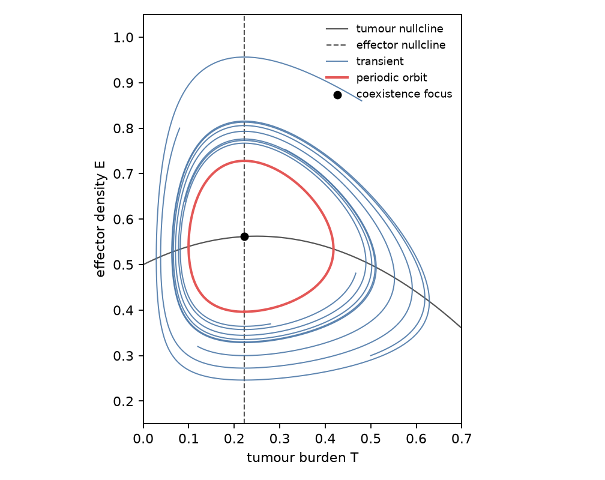
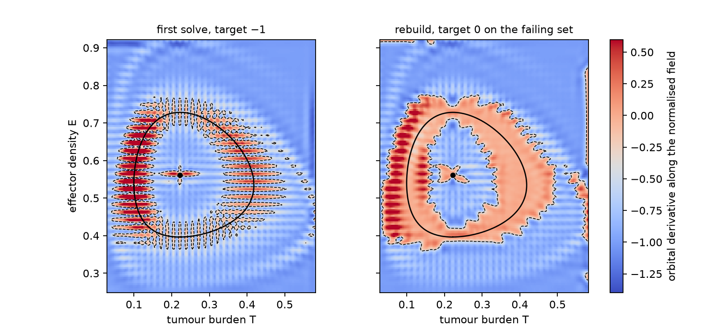
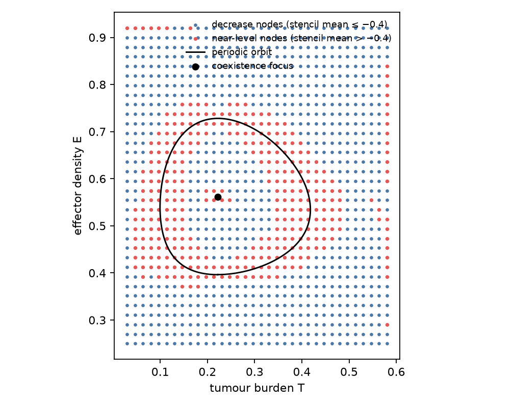
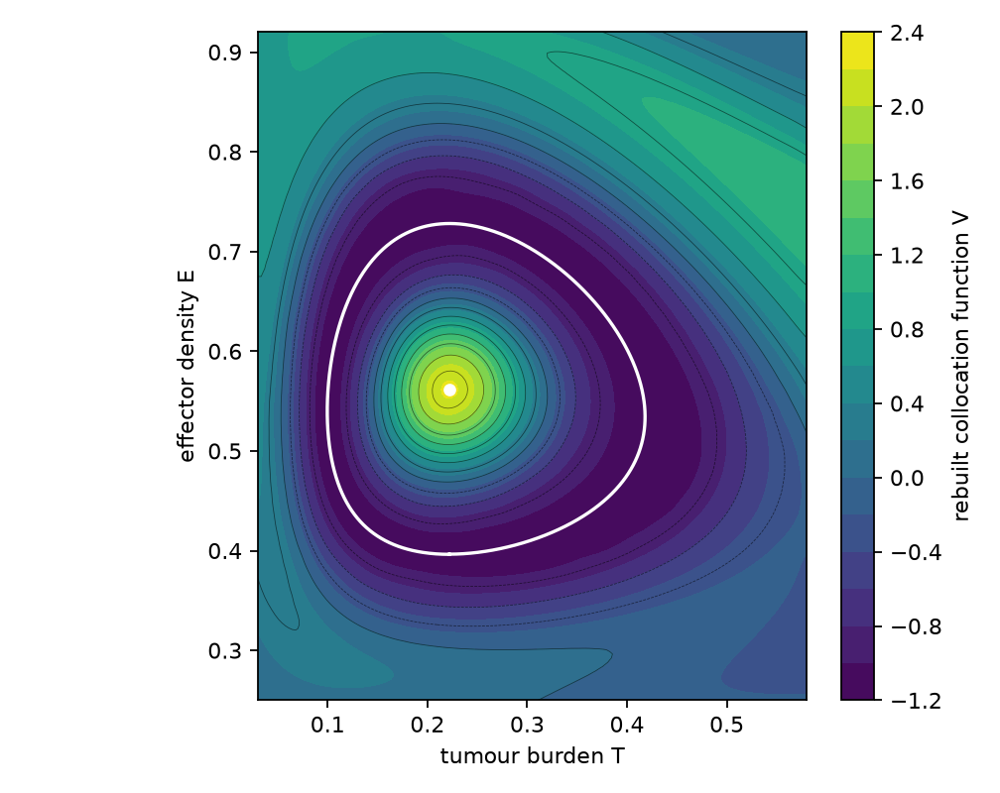
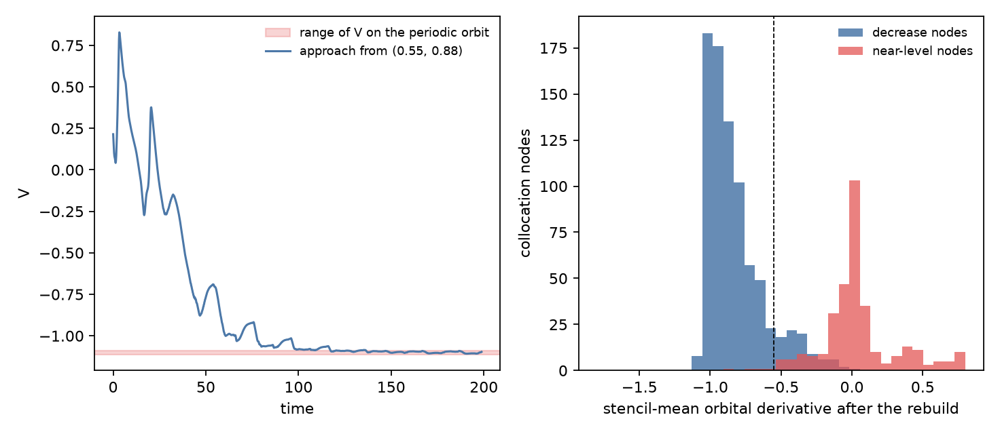
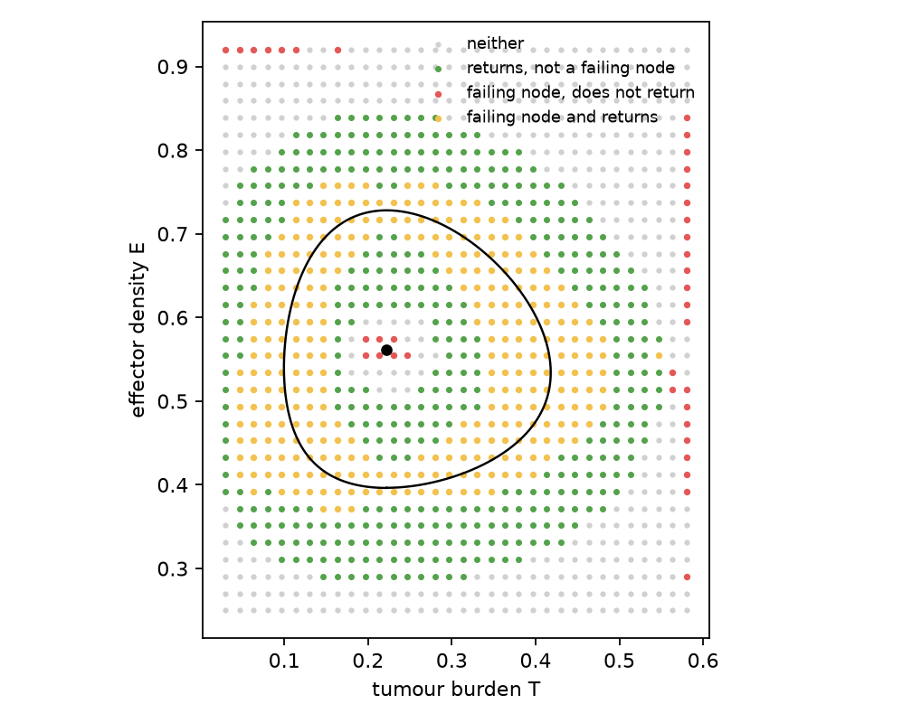

# Complete Lyapunov Functions and Chain-Recurrent Partitions for a Cancer-State Ordinary Differential Equation

**Thesis #17. Computational research thesis**  
**Author:** Kelechi Emeka Ogbonna  
**Correspondence:** kelechiogbonna300@gmail.com · https://github.com/cloudynirvana/thesis-17-complete-lyapunov-cancer-ode  
**Date:** 21 September 2026  
**Format:** B.Sc. project chapters (Nile University style), written as a computational methods manuscript  
**Status:** In-silico collocation on a declared toy vector field. Not a fit to a tumour. Not a clinical result.  
**Citation style:** numbered Vancouver. A `doi:` field appears only where Crossref returned the record.  
**DOI:** none for this document. Do not invent one.

---

## Title page

**COMPLETE LYAPUNOV FUNCTIONS AND CHAIN-RECURRENT PARTITIONS FOR A CANCER-STATE ORDINARY DIFFERENTIAL EQUATION**

BY

**KELECHI EMEKA OGBONNA**

A COMPUTATIONAL RESEARCH THESIS  
(IN-SILICO DYNAMICAL SYSTEMS STUDY)

SUBMITTED AS A CITEABLE MANUSCRIPT FOR JOURNAL / THESIS HANDOFF

PROJECT CONFLUENCE  
INDEPENDENT COMPUTATIONAL RESEARCH

SUPERVISOR: not appointed for this deposit

SEPTEMBER 2026

---

## Declaration

I, Kelechi Emeka Ogbonna, declare that this computational research thesis was carried out by me. The orbit, the collocation function, the failing set and the return scores reported here were produced by `sim/lyapunov.py`. The arithmetic does not use a random draw. The integer 20260921 is written into `sim/results.json` as a run label and does not enter the calculation. The figures are not wet-lab measurements and not patient outcomes. No DOI, ORCID or journal acceptance was invented for this document.

_________________________     _______________________  
Kelechi Emeka Ogbonna         Date

---

## Abstract

Can a complete Lyapunov construction (mesh-free / radial-basis ideas in the spirit of Argáez, Giesl, and Hafstein) partition a low-dimensional cancer-state ODE into chain-recurrent versus transient regions in a way that is reproducible from the vector field alone, without interpreting basins as treatment response? The calculation uses a planar tumour–effector equation with a saturated kill term and four declared constants. On the positive coexistence state the linearisation is an unstable focus. A periodic orbit of period 19.88 surrounds it. Both were read off the vector field by a section and by the Jacobian, before any Lyapunov function was built.

Meshless collocation with the Wendland function ψ4,2 asks the orbital derivative of a scalar function V, along a speed-normalised copy of the field, to equal −1. Nodes whose flow-aligned stencil mean exceeds a cut are then given target 0, and the system is solved once more. The cut is chosen from the menu −0.55, −0.40, −0.25 by a stated rule: smallest peak-to-peak change of V along the sampled orbit, among cuts that cover at least 95 percent of that orbit within two grid spacings. The rule selects −0.55.

On a 34×34 grid, 339 of 1156 nodes fail the cut. The periodic orbit lies entirely within two spacings of a failing node. The median distance from a failing node to the orbit or the focus is 0.028, and the 90th percentile is 0.072. Along the orbit, V changes by 0.024 from peak to peak, and the net change over one period is −0.0003. A transient started at (0.55, 0.88) drops by 1.31 over ten periods and ends inside that range. The same orbit coverage, and a peak-to-peak change between 0.020 and 0.026, appears on a 22×22 grid and on a 42×42 grid. The unstable focus is marked on the two finer grids and missed on the coarse one.

The failing set is a collocation defect, not a certified chain-recurrent set. The orbital derivative along the orbit is still positive on 46 percent of samples, with maximum 0.24. Further iterations thicken the set. A finite-time return test agrees with the tube around the orbit and stays quiet on the few nodes nearest the focus, and it also flags about half of the nodes the cut called transient. The vector field has one attractor in the window, the periodic orbit, so the calculation does not split the plane into two basins. There is no treatment parameter to read those regions as response.

Research only. Not a medical device, not a dose, and not a cure.

---

## Keywords

complete Lyapunov function; chain recurrence; meshless collocation; Wendland function; orbital derivative; tumour–effector equation; periodic orbit; Conley decomposition; computational dynamics; research only

---

## Table of Contents

DECLARATION  
ABSTRACT  
Table of Contents  
List of tables and figures  

CHAPTER ONE. INTRODUCTION  
1.1 Background to the study  
1.2 STATEMENT OF RESEARCH PROBLEM  
1.3 JUSTIFICATION OF STUDY  
1.4 AIM AND OBJECTIVES OF THE STUDY  
1.5 SIGNIFICANCE OF THE STUDY  
1.6 SCOPE OF THE STUDY  

CHAPTER TWO. LITERATURE REVIEW  
2.1 Chain recurrence and a complete Lyapunov function  
2.2 Meshless collocation for the orbital derivative  
2.3 What the failing set is, and what it is not  
2.4 Planar tumour–effector equations as vector fields  

CHAPTER THREE. MATERIALS AND METHODS  
3.1 Design  
3.2 Right-hand side  
3.3 Normalised field and collocation  
3.4 The cut, the rebuild, and the grids  
3.5 Independent checks  
3.6 What was not done  

CHAPTER FOUR. RESULTS  
4.1 The focus and the periodic orbit  
4.2 Where the first solve fails  
4.3 Decrease against a near-level orbit  
4.4 The same vector field on two other grids  
4.5 Return scores and nodes that leave the window  

CHAPTER FIVE. DISCUSSION, CONCLUSION AND RECOMMENDATION  
5.1 Discussion  
5.2 Conclusion  
5.3 Recommendation  

REFERENCES  
DISCLAIMER  

---

## List of tables and figures

**Table 3-1.** Declared constants of the toy field.  
**Table 3-2.** Collocation settings held fixed once the cut is selected.  
**Table 4-1.** Coexistence focus and the periodic orbit.  
**Table 4-2.** The three cuts on the 34×34 grid.  
**Table 4-3.** Five binary rebuilds at γ = −0.55.  
**Table 4-4.** Failing set on three Cartesian grids at the selected cut.  
**Table 4-5.** Finite-time return against the collocation partition.

**Figure 4-1.** Nullclines, transients, and the periodic orbit.  
**Figure 4-2.** Orbital derivative before and after the rebuild.  
**Figure 4-3.** Decrease nodes and near-level nodes.  
**Figure 4-4.** Level sets of the rebuilt function, with the orbit overlaid.  
**Figure 4-5.** Decrease of V along a transient, against the range of V on the orbit.  
**Figure 4-6.** Finite-time return against the failing set.

Figures are diagnostics from `sim/lyapunov.py`. They are not measured tumour burdens.

---

# CHAPTER ONE

## 1.0 INTRODUCTION

### 1.1 Background to the study

Cancer incidence figures set a reason to study models. They are not coefficients of a vector field. GLOBOCAN 2022, published in 2024, estimates a large global burden across 36 cancers in 185 countries [1]. Immune interaction sits in the later hallmarks list as evasion of destruction [2]. Mathematical oncology often writes that interaction as an ordinary differential equation and then simulates trajectories [3]. A review of the non-spatial models collects planar and higher tumour–immune systems, including saturated interaction terms and, for some published constants, periodic orbits [4]. Kuznetsov, Makalkin, Taylor and Perelson gave an early planar immunogenic-tumour equation and a bifurcation account of when a periodic orbit appears [5].

A trajectory plot answers a local question: where this initial value goes. Conley's decomposition asks a global one. On a compact metric space the flow splits into a chain-recurrent part, which carries the recurrent motion, and a gradient-like part, on which a continuous function decreases [6]. That function is a complete Lyapunov function. It is constant on each chain-transitive piece and strictly decreasing off the chain-recurrent set. It is a different object from a classical Lyapunov function, which is built in a basin of one attractor.

Argáez, Giesl and Hafstein construct numerical substitutes by meshless collocation. The orbital derivative is asked to equal a negative target. Where the approximation cannot meet the target, the nodes are treated as a stand-in for the chain-recurrent set, and the target there is replaced by zero [7]. Hurley's account of chain recurrence for semiflows is the analytic setting in which a decrease condition is tied to the recurrent set rather than to a single equilibrium [8].

The present work puts that construction on a two-dimensional tumour–effector field whose only ingredients are the right-hand side. The constants are declared. They are not estimated. The question is whether the failing nodes track the recurrent pieces that the vector field itself determines.

### 1.2 STATEMENT OF RESEARCH PROBLEM

Can a complete Lyapunov construction (mesh-free / radial-basis ideas in the spirit of Argáez, Giesl, and Hafstein) partition a low-dimensional cancer-state ODE into chain-recurrent versus transient regions in a way that is reproducible from the vector field alone, without interpreting basins as treatment response?

The working form of that question is narrow. The state is a tumour burden and an effector density. The vector field is the four-constant system in Section 3.2. Recurrence is read first from the Jacobian and from a Poincaré section, and then compared with the collocation failure set. Reproducibility means that a second and a third Cartesian grid, with the same cut rule, still cover the periodic orbit. The last clause is a ban on interpretation. A region in the plane is not a response class, and this vector field is not given a treatment parameter that could support that reading [6,7].

A familiar way to miss the question is to integrate a handful of initial values, colour the plane by which attractor they meet, and call the colours a chain-recurrent partition. Those colours are basins. Chain recurrence lives on the attractors, the repellers, and the orbits that stay, not on the open sets that flow toward them [6,8]. Another miss is to treat a classical Lyapunov function in one basin as if it classified the whole window.

### 1.3 JUSTIFICATION OF STUDY

The existence theorem does not compute the function. Conley's construction sums functions of attractor–repeller pairs [6]. It tells a reader that a complete Lyapunov function exists on a compact invariant set. It does not exhibit the level sets of a tumour–effector equation. The meshless method is one way to exhibit an approximation, and the error theory for collocation of a Lyapunov equation is available when the orbital-derivative problem has a solution [9]. A review of computational Lyapunov methods places radial-basis collocation among several constructions and separates a classical basin function from a complete one [10].

Those results are general. They do not say what this planar field does. The study is the calculation: an equilibrium and a periodic orbit computed from the right-hand side, a collocation function, and a comparison of its decrease set with its near-level set.

The study is also a boundary inside a series of computational manuscripts. Thesis #9 asks whether a shared metabolic ODE has identifiable rates under noisy maps [11]. Thesis #7 asks the same kind of question for a three-state tipping model with forcings held known [12]. Thesis #12 asks how a stiff–sloppy spectrum should be reduced [13]. Thesis #6 asks whether a sparse controller class is distinguishable, in simulation, from a lumped feedback on a toy cancer equation [14]. None of those questions is a chain-recurrent partition. Fisher rank and a control law are different objects from the geometry of one vector field. Saltelli and colleagues ask models to expose the assumptions on which a picture depends [15]. May's warning is the same demand, aimed at biology that borrows equations more readily than it audits them [16].

The study is not justified as a device, a dosing rule, or a claim that the interior of a periodic orbit is a treated class [15,16].

### 1.4 AIM AND OBJECTIVES OF THE STUDY

The aim is to test whether one meshless complete-Lyapunov construction, applied to the vector field in Section 3.2, separates a near-level set that tracks the periodic orbit from a decrease set in the rest of a fixed window, using no data other than the right-hand side.

The objectives are:

1. Locate the coexistence equilibrium, classify it by the Jacobian, and compute one periodic orbit by a section.
2. Build a Wendland collocation function for the orbital derivative on a Cartesian window, and mark nodes by a flow-aligned stencil mean.
3. Rebuild the function once, with target 0 on the marked nodes and target −1 off them, and compare the change of V along the orbit with the change of V along a transient.
4. Repeat the selected cut on a coarser grid and a finer grid.
5. Score a finite-time return that requires a real excursion, and keep clinical language out of the aim.

Non-aims. Estimating the four constants from a growth curve. Certifying chain recurrence by interval arithmetic. Adding a drug compartment and reading its basins as response. Ranking parameters by a Fisher matrix, or closing the loop with a controller.

### 1.5 SIGNIFICANCE OF THE STUDY

The useful product is a worked distinction among three sets that a phase portrait invites a reader to collapse. The periodic orbit is a geometric object computed from the field. The failing nodes are a numerical set attached to a cut. The open regions that flow toward the orbit are transient for a complete Lyapunov function, even though a long simulation spends its time near the orbit [6,8]. On this example those three sets can be drawn on one window and compared.

There is a second distinction inside the failing set. A tube around the orbit appears on every grid that was run. A small cluster at the unstable focus appears on the 34×34 and 42×42 grids and not on the 22×22 grid. Reproducibility from the vector field is therefore not uniform across the two recurrent pieces. The orbit tube is the stable output of the method. The focus is a resolution statement.

What the significance is not: a survival difference, a threshold for immune control, or a reason to treat a modelled burden as a patient [1,15].

### 1.6 SCOPE OF THE STUDY

In scope. One planar ODE. One compact rectangle in the positive quadrant. Wendland collocation of the orbital derivative along a speed-normalised field. One rebuild. Three grid sizes. Three cuts, with a declared selection rule. A return score and an exit score on the same nodes.

Out of scope. Kuznetsov's published parameter table, which belongs to a different right-hand side [5]. A hexagonal lattice, a quadratic program, and a cell-mapping graph. Three-dimensional tumour–immune equations, including those with an immunotherapy input [17]. Any map from these states to a dose. Regulatory use.

---

# CHAPTER TWO

## 2.0 LITERATURE REVIEW

### 2.1 Chain recurrence and a complete Lyapunov function

Let φ be a flow on a metric space. Fix ε > 0 and T > 0. An (ε, T)-chain from x to y is a finite sequence of points and times, starting at x and ending at y, such that each time is at least T and the true flow over that time lands within ε of the next point. The point x is chain recurrent when, for every ε and every T, some chain returns to x. The chain-recurrent set is closed and invariant when the phase space is compact [6]. Chain recurrence is weaker than periodicity. An equilibrium is chain recurrent. A periodic orbit is chain recurrent. A point that merely tends to a periodic orbit is not, once ε is smaller than the gap it must jump in order to come back.

Conley's theorem supplies a continuous function that is constant on the chain-transitive pieces and strictly decreasing on the complement [6]. Hurley extended the link between chain recurrence, attractors, and Lyapunov functions beyond the compact case that the 1978 lectures emphasise, including semiflows [8], and treated attraction in non-compact spaces separately [18]. The function in the theorem is not required to solve a partial differential equation. Existence is obtained by summing functions of attractor–repeller pairs. The numerical problem is the opposite: one is handed a differential equation and asked for a function.

A later existence result is closer to the collocation target used here. On a compact set that stays off the chain-recurrent set, the orbital derivative of a complete Lyapunov function may be prescribed as a negative continuous function, and the function can be taken as smooth as the vector field [19]. That theorem is a licence to ask for derivative −1 on a transient region. It is not a licence to ask for derivative −1 on a periodic orbit. The integral of the derivative around a closed orbit is zero, so the target −1 has no solution there. The failure of the target is the signal the algorithm uses [7,20].

### 2.2 Meshless collocation for the orbital derivative

Giesl's radial-basis construction for a classical Lyapunov function collocates the first-order equation ∇V · f = −1, with a compactly supported positive-definite kernel, and gives conditions under which the approximant really decreases [21]. Giesl and Wendland proved meshless error estimates for that kind of collocation and applied them to dynamical systems [9]. Wendland's functions are polynomials on a ball and zero outside it; the smoothness and the dimension in which they remain positive definite are fixed by two integer indices [22,23]. The present script uses ψ4,2, which is positive definite in the plane and smooth enough for the radial factors ψ1 and ψ2 in the orbital-derivative formula to have finite limits at the origin.

The passage from a classical Lyapunov function to a complete one, in this line of work, is an iteration. A first solve pretends the whole window is transient. Nodes at which the orbital derivative misses the negative target are collected. The next solve asks for derivative 0 on that set and for a negative value off it [20]. A later paper replaces the hard jump in the target by averaged stencil values, and rescales the target so that the sum of absolute values stays constant, because an unscaled iteration can drift toward the zero function [7]. The same authors have also posed the search as a quadratic program with differential inequalities, with a convergence theorem in a Sobolev norm, and without an a-priori recurrent set [24]. That program is not the method run here. It is the natural next algorithm, and Chapter 3 says so.

Two other computational routes locate chain recurrence by discretising the phase space into cells and building a graph of the time-T map. Kalies, Mischaikow and VanderVorst give an algorithmic treatment of chain recurrence in that language [25]. Dellnitz, Froyland and Junge describe the set-oriented machinery behind GAIO [26]. A continuous piecewise-affine Lyapunov function for several attractors has been computed on a simplicial grid, but the method described by Björnsson, Giesl, Hafstein and Kellett takes a superset of the chain-recurrent set as an input [27]. The meshless iteration is attractive here because the only required input is the right-hand side. The price is that the output is a failing set of a linear system, which still has to be compared with an orbit one can compute independently.

### 2.3 What the failing set is, and what it is not

Argáez, Giesl and Hafstein are explicit that the region where the collocation misses V′ ≈ −1 is an indication of where the chain-recurrent set lies, and that the matrix remains nonsingular as long as no collocation node is an equilibrium [7]. Nonsingularity is a statement about linear algebra. It does not mean the partial differential equation has a solution. The error estimates of the classical theory apply when a solution exists [9,21]. On a window that contains a periodic orbit, a solution of V′ = −1 does not exist, and the size of the residual is the object of interest.

A second gap sits between chain recurrence and any finite-time test. Returning close to the start after one period, having first travelled a definite distance, is evidence of a periodic orbit or of a point already in a thin neighbourhood of one. It is not an ε-chain for every ε. A point near a weakly unstable focus moves very little in one period. If a test only asks whether the point is still near its start, the focus looks recurrent for a trivial reason. The test in Section 3.5 therefore demands an excursion before it will call a node a return. Even then, the score is not Conley's definition [6].

The speed normalisation used by Argáez, Giesl and Hafstein replaces f with a field of nearly unit length away from equilibria, so that a target of −1 does not simply trace the raw speed [7]. The oriented orbits are unchanged wherever f is not zero. Chain equivalence under a time reparameterisation is a theorem only under hypotheses this window has not been checked against. The partition reported in Chapter 4 is a partition for the normalised field on the rectangle. The section and the Jacobian, which do not use the normalisation, are the external description of the same orbits.

### 2.4 Planar tumour–effector equations as vector fields

Eftimie, Bramson and Earn review non-spatial tumour–immune equations and record both saturated interaction terms and periodic regimes [4]. Kuznetsov and colleagues studied a different planar system, with a rational recruitment term, and located periodic orbits by bifurcation in their own constants [5]. The right-hand side in Chapter 3 is in that modelling tradition and is not their equation. The four numbers were chosen so that the coexistence state is an unstable focus and the orbit sits inside a rectangle that excludes the axial saddles. They were not fitted.

Kirschner and Panetta placed an immunotherapy input in a three-dimensional tumour–immune equation [17]. No such input is present here. A drug term would be a different vector field. Thesis #6 studies controllers on a toy cancer equation as policy classes [14]. This manuscript does not close a loop. The attractor in the window is one periodic orbit. Points inside it and points outside it, insofar as they remain in a trapping neighbourhood, approach that same orbit. There is not a pair of basins waiting to be labelled response and failure.

---

# CHAPTER THREE

## 3.0 MATERIALS AND METHODS

### 3.1 Design

The vector field, the window, and the grids are declared. No time series is read from a file. No random sample is drawn. The run label 20260921 is stored in `sim/results.json` and is not an input to the arithmetic.

The production grid is 34 by 34 nodes on the rectangle

T ∈ [0.03, 0.58], &nbsp; E ∈ [0.25, 0.92].

The larger spacing on that grid is h = 0.0203. A 22 by 22 grid and a 42 by 42 grid use the same rectangle. The software is `sim/lyapunov.py`. Before the collocation, the script checks the orbital-derivative formula by a centred difference on a linear rotation, and it checks that a five-node system with target −1 is recovered at the nodes. Either check aborts the run.

### 3.2 Right-hand side

States are a tumour burden T, in units of a carrying capacity, and an effector density E, in units of a reference density. Time is scaled by the tumour growth rate. The field is

dT/dt = T (1 − T) − a T E / (b + T),

dE/dt = c a T E / (b + T) − d E.

The constants are those in Table 3-1. The kill term is a smooth saturation. At E = 0 the tumour axis is invariant and the carrying state (1, 0) is an equilibrium. At T = 0 the effector axis is invariant and (0, 0) is an equilibrium. Both lie outside the rectangle. Their roles are recorded in Chapter 4 so that the window is not mistaken for the whole quadrant.

**Table 3-1.** Declared constants of the toy field.

| Symbol | Value | Role in the toy |
| --- | --- | --- |
| a | 1 | scale of the saturated kill |
| b | 1/2 | half-saturation in the same units as T |
| c | 13/20 | conversion of kill into effector growth |
| d | 1/5 | effector clearance |

The positive coexistence state, when c a > d, is available in closed form:

T* = d b / (c a − d) = 2/9,

E* = (1 − T*) (b + T*) / a = 91/162.

The Jacobian at a general point is differentiated from the right-hand side in the script. At the coexistence state the effector row contributes a zero diagonal entry, which is the usual algebra of a factor E times a per-capita growth that vanishes there. Stability is then the sign of the remaining trace. The eigenvalues are computed numerically from that Jacobian and checked against the trace and determinant.

The periodic orbit is computed by integrating an initial value near the focus for time 420, discarding the transient, and cutting the orbit at upward crossings of T = T*. The period is the median of the last four return times. One inter-crossing segment is stored as the sampled orbit. That orbit is the geometric object the collocation is compared with. It is not an input to the linear system, except as a measuring tape after the solve.

### 3.3 Normalised field and collocation

Let f denote the right-hand side. The collocation field is the normalisation used by Argáez, Giesl and Hafstein [7],

f̂(x) = f(x) / √(δ² + ||f(x)||²), &nbsp; δ² = 10−8.

Away from equilibria, ||f̂|| is close to 1. At an equilibrium, f̂ is zero. No grid node landed on an equilibrium in these runs.

The kernel is the Wendland function ψ4,2, scaled as ψ0(r) = ψ4,2(c r), with support radius 1/c. On the unit interval the unscaled function used by the script is the polynomial

ψ4,2(r) = (1 − r)6/30 − 11(1 − r)7/210 + (1 − r)8/48,

and it is zero for r ≥ 1. The radial factors ψ1 and ψ2 are the successive operations (1/r) d/dr, with the finite limits ψ1(0) = −c2/30 and ψ2(0) = c4. The shape c is set so that the support radius equals nine times the larger grid spacing. On the 34×34 grid that radius is 0.183.

The approximant and its orbital derivative along f̂ are the standard symmetric collocation formulae [7,21]. With nodes xj and coefficients βj,

V(x) = Σj βj ⟨xj − x, f̂(xj)⟩ ψ1(||x − xj||).

The collocation matrix A is the matrix of the orbital derivative of this expression at the nodes. Its diagonal entries are

Aii = −ψ1(0) ||f̂(xi)||².

The off-diagonal entries follow the product rule recorded in the 2018 paper [7]. The script checks that A is symmetric to rounding error and that its smallest eigenvalue is positive, then solves A β = r by a dense symmetric solver. On every grid in Chapter 4 the node residual ||A β − r||∞ is below 10−12. That residual says the linear system was solved. It does not say that V′ equals the target between the nodes.

### 3.4 The cut, the rebuild, and the grids

Each node is given a flow-aligned stencil: four points in the direction of f̂ and four points against it, at steps 0.4 h, 0.8 h, 1.2 h and 1.6 h, where h is the larger spacing. The decision statistic is the mean of the orbital derivative on those eight points. A node is marked failing when the mean exceeds γ.

The value of γ is selected from the menu −0.55, −0.40, −0.25 on the 34×34 grid. A cut is eligible when at least 95 percent of the sampled orbit lies within two spacings of some failing node. Among eligible cuts, the script keeps the one whose rebuilt function has the smallest peak-to-peak change of V along the orbit. Chapter 4 records all three cuts. The rule is a property of this vector field and this menu. It was not fixed before the menu was computed. That is a limitation of the design, and it is why the other two cuts are published rather than discarded in silence.

The reported function is one rebuild. The first solve uses target −1 at every node. The failing set of that solve becomes the zero-target set. The second solve uses target 0 on those nodes and target −1 on the others. The partition drawn in the figures is the failing set of the first solve. The function V and the orbital-derivative field drawn after the rebuild are the second solve.

For the record, the script also continues the binary rebuild for five iterations, reclassifying from the new function each time. Those iterations are not the reported function. They measure whether the set stays put. The 2018 paper introduced averaging and rescaling because a hard 0/−1 iteration can drift [7]. The hard iteration is used here exactly so that the drift, if it appears, is visible in a table.

The any-point rule of that paper, which marks a node when any stencil sample exceeds γ, is computed on the first solve and stored. It is not the rule that builds V. On this field it marks a fatter set. The departure is intentional and numerical: a single stencil sample past the cut was pulling in nodes far from the orbit during preliminary checks.

**Table 3-2.** Collocation settings held fixed once the cut is selected.

| Setting | Value |
| --- | --- |
| Kernel | Wendland ψ4,2 |
| Normalisation | δ² = 10−8 |
| Support radius | 9 times the larger spacing |
| Stencil | 4 samples each way, step 0.4 spacing, then the mean |
| Rebuild | one solve, target 0 on the failing set and −1 off it |
| Selection menu | γ ∈ {−0.55, −0.40, −0.25} |

### 3.5 Independent checks

Four checks do not use the coefficients β, or use them only as a measuring tape.

The Jacobian eigenvalues at T* and at the axial equilibria are properties of f. The period and the bounding box of the orbit are properties of a numerical trajectory of f. Agreement between the failing set and that orbit is the main geometric test.

Along the sampled orbit the script evaluates V and the orbital derivative of the rebuilt function. The peak-to-peak change and the net change are recorded. The net change on a closed orbit of a C1 function must be near zero; a large net change would mean the stored segment had not closed, or the evaluator was wrong. The peak-to-peak change can be positive even when the net change vanishes, and that number is the flatness.

A transient is started at (0.55, 0.88), outside the orbit's bounding box, and integrated for ten periods. V along that curve is the decrease the complete-Lyapunov story asks for. The comparison in Chapter 4 is the drop on this transient against the peak-to-peak change on the orbit. The drop over the first period alone is also stored, because the approach on this field is slow and a short window understates it.

The return score uses a fixed-step Runge–Kutta integration of f, for two periods, on every collocation node. A node counts as a return only if its maximum distance from the start is at least 0.12 and, at some time between 0.85 and 1.15 periods, its distance from the start is below 0.06. The excursion floor is there so that a point sitting near the weakly unstable focus is not called recurrent for failing to move. A node is also flagged if its trajectory leaves the rectangle enlarged by 0.02 in each coordinate. Leaving the window is not chain recurrence. It is a statement that the rectangle is not positively invariant.

### 3.6 What was not done

No interval arithmetic encloses the orbit or the failing set. The method is not a computer-assisted proof of chain recurrence.

The grid is Cartesian. The 2018 paper uses a hexagonal lattice because the separation distance and the fill distance are balanced there [7]. A lattice changes the condition number. It is not a different scientific question, and it was not run.

The quadratic program of Giesl, Argáez, Hafstein and Wendland was not solved [24]. The averaged-and-rescaled iteration of the 2018 paper was not the production solver [7]. Both are cited so that the simpler rebuild is not confused with the sharpest method in the line.

No ε-chain is enumerated. No parameter is estimated. No immunotherapy or drug coordinate is added [14,17]. No Fisher matrix is formed [11,12,13].

---

# CHAPTER FOUR

## 4.0 RESULTS

### 4.1 The focus and the periodic orbit

The coexistence state is

T* = 0.2222, &nbsp; E* = 0.5617.

The Jacobian eigenvalues there are 0.008547 ± 0.3281 i. The state is an unstable focus. The linear period 2π / 0.3281 is 19.15. The section returns a nonlinear period of 19.88. The sampled orbit ranges over T ∈ [0.0996, 0.4181] and E ∈ [0.3963, 0.7281]. It lies inside the rectangle with a margin on every side.

At (0, 0) the eigenvalues of the linearisation are 1 and −0.2, so the origin is a saddle, repelling along the tumour axis. At (1, 0) the eigenvalues are −1 and 0.233, so the carrying state with no effectors is a saddle, repelling in the effector direction. Neither point is a collocation node. Figure 4-1 shows the tumour nullcline, the vertical effector nullcline T = T*, four transients, and the periodic orbit they approach.

**Table 4-1.** Coexistence focus and the periodic orbit.

| Object | Value |
| --- | --- |
| (T*, E*) | (0.2222, 0.5617) |
| Eigenvalues | 0.008547 ± 0.3281 i |
| Linear period | 19.15 |
| Nonlinear period | 19.88 |
| Orbit box in T | 0.0996 to 0.4181 |
| Orbit box in E | 0.3963 to 0.7281 |

**Figure 4-1.** The dashed line is the effector nullcline T = T*. The solid grey curve is the tumour nullcline in the positive quadrant. Blue curves are transients. The red closed curve is one section-to-section segment of the periodic orbit. The black point is the unstable focus.

The picture has one attractor in view. Transients from inside the orbit and from outside it approach the same closed curve. A basin colouring of this window would be a single colour. That fact is the geometric content of the ban in the problem statement: there is no second basin here to interpret as a treatment response, and the vector field contains no treatment term that would create one.

### 4.2 Where the first solve fails

On the 34×34 grid the collocation matrix has condition number 5.96×103 and smallest eigenvalue 0.00358. The node residual after the rebuild is 2.6×10−13.

The selection rule of Section 3.4 keeps γ = −0.55. At that cut, 339 of 1156 nodes fail (29.3 percent). Every sample of the periodic orbit lies within 1.5 spacings of a failing node. The median distance from a failing node to the union of the orbit and the focus is 0.028. The 90th percentile is 0.072. Thirty-one failing nodes, 9.1 percent of the failing set, lie more than 0.10 from that union. They are the stray part of the set, and they are included in the counts rather than deleted.

Of the failing nodes, 332 are closer to the orbit than to the focus. Their median distance to the orbit is 0.028 and their 90th percentile is 0.072. Seven failing nodes are closer to the focus than to the orbit. That cluster extends at most 0.029 from the focus, and the nearest failing node to the focus is 0.011 away. The failing set is therefore a tube about the periodic orbit together with a few nodes at the focus, plus a minority of strays. It is not a filled disk, and it is not two cleanly separated chain classes drawn at the scale of the grid.

The any-point rule, applied to the same first solve, marks 47.1 percent of the nodes. The mean rule marks 29.3 percent. The figures use the mean rule.

Figure 4-2 shows the orbital derivative of the first solve and of the rebuild on a fine plotting grid. The first solve is asked for −1 everywhere, and it cannot meet that target on the orbit. The rebuild pushes the tube toward zero and leaves the complementary region negative. The black contour in each panel is the level −0.4, drawn as a visual guide, not as the decision cut. The decision cut −0.55 was applied to stencil means, not to this plotting grid.

**Figure 4-2.** Orbital derivative along the normalised field. Left: first solve, target −1 at every node. Right: rebuild, target 0 on the failing nodes and −1 on the others. The closed curve is the periodic orbit. Colour runs from negative values (blue) through zero to positive values (red). The black contour is the level −0.4.

Figure 4-3 plots the nodes themselves. Blue nodes are the decrease set of the first solve. Red nodes are the failing set.

**Figure 4-3.** Blue: stencil mean at most −0.55 on the first solve. Red: stencil mean above −0.55. The black curve is the periodic orbit and the black point is the focus.

### 4.3 Decrease against a near-level orbit

After the rebuild, the stencil-mean orbital derivative has median +0.014 on the failing nodes and median −0.878 on the decrease nodes. At the nodes themselves the orbital derivative equals the target up to the solver residual, by construction of the linear system. The stencil medians are the off-node check. They sit near 0 and near −1, with a gap of about 0.9 between the two medians.

Along the sampled orbit the rebuilt function has mean −1.100, peak-to-peak change 0.0243, and net change −0.00025. The net change is the closure check. The peak-to-peak change is the flatness. The orbital derivative along the same samples has median −0.0025, tenth percentile −0.100, ninetieth percentile +0.112, and maximum +0.236. It is positive on 45.6 percent of the samples. The orbit is therefore near-level in the integrated sense, and it is not a certified region of non-positive derivative. A complete Lyapunov function in the sense of the theorem would not increase along the orbit [6,19]. The collocation function still does, by as much as 0.24, on a target scale whose transient value is −1.

The transient from (0.55, 0.88) starts at V = 0.215. Over the first period, V falls only by 0.006. The approach is slow, which the small real part 0.00855 of the focus already suggests for the interior, and the exterior approach on this constant set is slow as well. Over ten periods, V falls by 1.311, from 0.215 to −1.096. The orbit's range is −1.100 ± 0.012. The transient ends inside that range. The drop 1.311 is about fifty times the peak-to-peak change 0.024 on the orbit. Figure 4-4 draws the level sets of the same function, with the orbit overlaid in white. Figure 4-5 draws the transient against that range.

**Figure 4-4.** Level sets of V after the rebuild. The white closed curve is the periodic orbit. The white point is the focus. The absolute level of V is a gauge of the collocation; the comparison that matters is the change along a curve.

**Figure 4-5.** Left: V along the transient from (0.55, 0.88). The red band is the range of V on the periodic orbit. Right: stencil-mean orbital derivative of the rebuilt function. Blue bars are decrease nodes. Red bars are failing nodes. The dashed line is γ = −0.55, the cut that was applied to the first solve.

Table 4-2 records the menu. The cut −0.25 covers only 82.7 percent of the orbit within two spacings, so the rule discards it. Its peak-to-peak change on the orbit is 0.213, and the orbital derivative along the orbit reaches 1.30. The cut −0.40 is eligible, with 96.4 percent coverage, a thinner tube (90th percentile distance 0.056), and a worse flatness (peak-to-peak 0.098; positive orbital derivative on 77.6 percent of orbit samples, maximum 0.61). The cut −0.55 is eligible and flatter, and the rule selects it. The price is a thicker tube.

**Table 4-2.** The three cuts on the 34×34 grid, each after one rebuild.

| γ | Failing nodes | Cover within 2h | Distance, 90th percentile | Peak-to-peak of V on the orbit | Maximum of V′ on the orbit |
| --- | --- | --- | --- | --- | --- |
| −0.55 | 339 (29.3%) | 1.00 | 0.072 | 0.024 | 0.236 |
| −0.40 | 237 (20.5%) | 0.964 | 0.056 | 0.098 | 0.610 |
| −0.25 | 168 (14.5%) | 0.827 | 0.170 | 0.213 | 1.303 |

Table 4-3 continues the binary rebuild past the reported function. By the second iteration the 90th percentile distance has jumped from 0.072 to 0.179, and the failing fraction has risen from 0.293 to 0.365. By the fifth iteration almost half the nodes fail, while the peak-to-peak change has only moved from 0.024 to 0.012. Extra iterations buy a little flatness and spend it on a much fatter set. The reported partition is iteration 1.

**Table 4-3.** Five binary rebuilds at γ = −0.55 on the 34×34 grid.

| Iteration | Failing fraction | Distance, 90th percentile | Cover within 2h | Peak-to-peak of V |
| --- | --- | --- | --- | --- |
| 1 | 0.293 | 0.072 | 1.00 | 0.024 |
| 2 | 0.365 | 0.179 | 1.00 | 0.017 |
| 3 | 0.421 | 0.187 | 1.00 | 0.015 |
| 4 | 0.463 | 0.188 | 1.00 | 0.014 |
| 5 | 0.495 | 0.187 | 1.00 | 0.012 |

### 4.4 The same vector field on two other grids

The selected cut was then held fixed. Nothing in the coarse or fine run was allowed to choose a new γ.

On the 22×22 grid, 160 of 484 nodes fail (33.1 percent). The orbit is covered within 1.5 spacings. The median distance from a failing node to the orbit or the focus is 0.033, and the 90th percentile is 0.094. The peak-to-peak change of V on the orbit is 0.020. The nearest failing node to the focus is 0.073 away, and no failing node is closer to the focus than to the orbit. The coarse grid sees the orbit and misses the focus as its own cluster.

On the 42×42 grid, 549 of 1764 nodes fail (31.1 percent). Coverage within 1.5 spacings is complete. The median distance is 0.029 and the 90th percentile is 0.081. The peak-to-peak change of V on the orbit is 0.026. The nearest failing node to the focus is 0.0046 away, and 13 failing nodes form the focus-side cluster.

Across the three grids the orbit coverage at two spacings is complete, and the peak-to-peak change of V along the orbit stays between 0.020 and 0.026. The absolute level of V does not: the mean of V on the orbit is −1.29 on the coarse grid, −1.10 on the production grid, and −0.85 on the fine grid. The collocation does not fix an additive gauge, and a comparison of levels across grids is empty. The comparison that repeats is the change along the orbit.

The stencil medians repeat as well. On the decrease nodes they are −0.891, −0.878 and −0.892. On the failing nodes they are −0.025, +0.014 and +0.024. The gap between decrease and near-level is stable. The sign of the failing median is not a theorem. It changes with the grid.

**Table 4-4.** Failing set on three Cartesian grids at γ = −0.55.

| Grid | Nodes | Failing fraction | Cover within 2h | Median distance | 90th percentile | Peak-to-peak of V | Nearest failing node to the focus |
| --- | --- | --- | --- | --- | --- | --- | --- |
| 22×22 | 484 | 0.331 | 1.00 | 0.033 | 0.094 | 0.020 | 0.073 |
| 34×34 | 1156 | 0.293 | 1.00 | 0.028 | 0.072 | 0.024 | 0.011 |
| 42×42 | 1764 | 0.311 | 1.00 | 0.029 | 0.081 | 0.026 | 0.0046 |

Condition numbers were 5.17×103, 5.96×103 and 6.41×103. None of the solves was a numerical collapse.

### 4.5 Return scores and nodes that leave the window

Over two periods of the original field, 22.4 percent of the 1156 nodes leave the rectangle enlarged by 0.02. Among failing nodes the exit fraction is 3.8 percent. Among decrease nodes it is 30.1 percent. The tube around the orbit is largely a set of nodes whose forward orbit stays nearby. A substantial part of the decrease set is not a set of nodes that remain in the window. The rectangle is a computational domain, not a trapping region, and the collocation on nodes that leave it is the weakest part of the partition.

The return score, which demands an excursion of at least 0.12 and a passage within 0.06 of the start near one period, marks 61.0 percent of all nodes. It marks 89.1 percent of failing nodes and 49.3 percent of decrease nodes. On the 287 failing nodes that form the orbit-side tube, the return fraction is 1. On the 7 failing nodes of the focus-side cluster, the return fraction is 0.

The return test and the collocation cut therefore agree on two small statements and disagree on a large one. The orbit tube returns. The focus cluster does not, once an excursion is required: those nodes barely move, which is what a weak focus does, and the test refuses to call that a return. About half of the nodes called transient by the cut still satisfy the return inequalities. They sit near enough to the orbit that one period brings them back within 0.06, even though their stencil mean on the first solve was more negative than −0.55. Finite-time return paints a thicker neighbourhood of the orbit than the failing set does. It is not a second copy of the partition, and it is not an ε-chain test [6].

Figure 4-6 shows the four combinations.

**Figure 4-6.** Grey: decrease node, no return. Green: decrease node that meets the return inequalities. Red: failing node that does not return. Gold: failing node that returns. The black curve is the periodic orbit.

**Table 4-5.** Finite-time return against the collocation partition on the 34×34 grid.

| Set | Count | Fraction that return | Fraction that leave the enlarged window |
| --- | --- | --- | --- |
| All nodes | 1156 | 0.610 | 0.224 |
| Failing nodes | 339 | 0.891 | 0.038 |
| Decrease nodes | 817 | 0.493 | 0.301 |
| Orbit-side failing nodes | 287 | 1.00 | — |
| Focus-side failing nodes | 7 | 0.00 | — |

---

# CHAPTER FIVE

## 5.0 DISCUSSION, CONCLUSION AND RECOMMENDATION

### 5.1 Discussion

The problem asked whether a meshless complete-Lyapunov construction can separate chain-recurrent pieces from transient pieces of a low-dimensional cancer-state equation, using the vector field alone, and without a reading of basins as treatment response.

On the evidence of Chapter 4, the construction separates a near-level tube around the periodic orbit from a decrease set, and it does so on three grids with the cut held fixed. The peak-to-peak change of V on the orbit stays near 0.02 while a transient of the same function drops by 1.31. That is the sense in which the orbit is a near-level set and the approach to it is a decrease. The separation is reproducible from f in the operational sense used here: the script never reads a measurement, and the coarse and fine grids were not given a new cut.

The same evidence limits the claim. The failing set is thicker than the orbit. About one failing node in eleven lies more than 0.10 from the orbit and the focus. The orbital derivative along the orbit is positive on nearly half the samples. The theorem asks for a derivative that does not increase on a chain-recurrent orbit [6,19]. The rebuild reduces the integrated change to 0.024 and does not enforce the pointwise sign. Further binary iterations, which are the simplest reading of the early algorithm [20], thicken the set much faster than they flatten V. That is the practical content of the warning in the 2018 paper, visible here as Table 4-3 [7].

The unstable focus is the second recurrent piece, and the method does not treat it as reliably as the orbit. A handful of nodes sit on it when the spacing is 0.020 or 0.016. At spacing 0.032 the nearest failing node is 0.073 away, which is a miss. A reader who looked only at the coarse figure would report a single recurrent component, the periodic orbit. That report would be incomplete about the chain-recurrent set and accurate about what this cut resolves. The return score supports the distinction the coarse grid blurs: the focus-side nodes do not travel, and the test, because it requires an excursion, does not call them recurrent. The orbit-side nodes all return.

The window itself is part of the result. Almost a quarter of the nodes leave an enlarged rectangle within two periods, and those exits are concentrated in the decrease set. Conley's theorem is a theorem about a flow on a compact invariant set [6]. A rectangle drawn around a periodic orbit, with a collar that trajectories cross, is not that object. Hurley's non-compact theory does not repair a collocation that was only ever posed inside the rectangle [18]. The honest description is local: inside this window, the failing nodes track the orbit, a minority of them are stray or sit on the focus, and many of the other nodes are on their way out of the window as well as on their way toward the orbit.

The treatment-response reading is unavailable for a more elementary reason than a disclaimer. The phase portrait has one periodic attractor. Interior and exterior transients approach it. A basin label would not split the window into two outcomes. Adding a drug coordinate would create a different vector field [17], and a controller class is a different question [14]. Identifiability of a rate vector is a different question again [11,12,13]. None of those calculations is a substitute for the pictures in Chapter 4, and the pictures are not a substitute for them.

The cut was selected from a menu of three after the orbit was known. The rule is mechanical and the losers are in Table 4-2, but the menu was informed by preliminary solves on this same field. A cut fixed in ignorance of the orbit might have been −0.25, which leaves gaps, or a value outside the menu, which was not tried. The support multiple, nine spacings, was also fixed from preliminary solves. Both choices are part of the method as run, and both are limitations on the phrase "from the vector field alone." The grids test the cut once it is chosen. They do not test the human choice of the menu.

### 5.2 Conclusion

A Wendland collocation for the orbital derivative, with one rebuild at γ = −0.55, partitions the declared tumour–effector window into a decrease set and a failing set. The failing set covers the periodic orbit on grids of 22×22, 34×34 and 42×42 nodes. Along that orbit the rebuilt function changes by about 0.02, while it drops by 1.31 along a transient that ends in the same range. The unstable focus is resolved only on the finer grids. The orbital derivative still changes sign along the orbit. Extra iterations thicken the failing set. A finite-time return test recovers the orbit tube, rejects the focus cluster, and also marks about half of the decrease nodes. The window is not invariant. The vector field has no treatment parameter, and the window has one attractor, so the partition is not a response classification.

The calculation is research on a toy right-hand side. It is not a medical device, not a dose, and not a cure.

### 5.3 Recommendation

1. Treat a failing set of this collocation as a hypothesis about the recurrent pieces, and keep an independent orbit or equilibrium next to it. Coverage and a distance percentile belong in the same table as the picture [7,20].
2. Publish the cut, the support radius, and the stencil rule. A single integer count of failing nodes is not a partition.
3. Stop a hard 0/−1 iteration when the set thickens, or switch to the averaged rescaling [7] or the quadratic program [24], and say which one was run.
4. Do not interpret the sign of the orbital derivative along a periodic orbit as settled when a large minority of samples is still positive. Report the maximum.
5. Keep basins, chain-recurrent components, and treatment variables in different sentences. This field has one attractor in the window and no treatment variable [14,15,17].
6. Leave dosing, device claims, and clinical decision rules outside papers of this type [15].
7. A document DOI, if one is minted later, belongs in `CITATION.cff` only after it exists.

---

## REFERENCES

Journal items use Vancouver form. DOI strings are those returned by Crossref for the cited version. Internet items have no `doi:` field. This document has no DOI.

1. Bray F, Laversanne M, Sung H, Ferlay J, Siegel RL, Soerjomataram I, et al. Global cancer statistics 2022: GLOBOCAN estimates of incidence and mortality worldwide for 36 cancers in 185 countries. CA Cancer J Clin. 2024;74(3):229-263. doi:10.3322/caac.21834.
2. Hanahan D, Weinberg RA. Hallmarks of cancer: the next generation. Cell. 2011;144(5):646-674. doi:10.1016/j.cell.2011.02.013.
3. Altrock PM, Liu LL, Michor F. The mathematics of cancer: integrating quantitative models. Nat Rev Cancer. 2015;15(12):730-745. doi:10.1038/nrc4029.
4. Eftimie R, Bramson JL, Earn DJD. Interactions between the immune system and cancer: a brief review of non-spatial mathematical models. Bull Math Biol. 2011;73(1):2-32. doi:10.1007/s11538-010-9526-3.
5. Kuznetsov VA, Makalkin IA, Taylor MA, Perelson AS. Nonlinear dynamics of immunogenic tumors: parameter estimation and global bifurcation analysis. Bull Math Biol. 1994;56(2):295-321. doi:10.1016/S0092-8240(05)80260-5.
6. Conley C. Isolated invariant sets and the Morse index. Providence (RI): American Mathematical Society; 1978. (CBMS Regional Conference Series in Mathematics; 38). ISBN 978-0-8218-1688-2. doi:10.1090/cbms/038.
7. Argáez C, Giesl P, Hafstein S. Iterative construction of complete Lyapunov functions. In: Proceedings of the 8th International Conference on Simulation and Modeling Methodologies, Technologies and Applications (SIMULTECH 2018). Setúbal: SciTePress; 2018. p. 211-222. ISBN 978-989-758-323-0. doi:10.5220/0006835402110222.
8. Hurley M. Chain recurrence, semiflows, and gradients. J Dyn Differ Equ. 1995;7(3):437-456. doi:10.1007/BF02219371.
9. Giesl P, Wendland H. Meshless collocation: error estimates with application to dynamical systems. SIAM J Numer Anal. 2007;45(4):1723-1741. doi:10.1137/060658813.
10. Giesl P, Hafstein S. Review on computational methods for Lyapunov functions. Discrete Contin Dyn Syst Ser B. 2015;20(8):2291-2331. doi:10.3934/dcdsb.2015.20.2291.
11. Ogbonna KE. Structural and practical identifiability of a shared metabolic cancer ODE under multi-channel noisy observation maps [Internet]. Thesis #9 computational research thesis. 2026 [cited 2026 Sep 21]. Available from: https://github.com/cloudynirvana/thesis-09-ccle-metabolic-ode-identifiability
12. Ogbonna KE. Structural and practical identifiability of a TNBC ATP–ROS–glucose tipping-point ODE under phytochemical/nanocarrier forcings [Internet]. Thesis #7 computational research thesis. 2026 [cited 2026 Sep 21]. Available from: https://github.com/cloudynirvana/thesis-07-tnbc-tipping-identifiability
13. Ogbonna KE. Stiff–sloppy spectra and systematic reduction of high-dimensional cancer-state ODEs [Internet]. Thesis #12 computational research thesis. 2026 [cited 2026 Sep 21]. Available from: https://github.com/cloudynirvana/thesis-12-stiff-sloppy-cancer-ode-reduction
14. Ogbonna KE. Sparse connectome-style controllers as in-silico policy classes: identifiable closed-loop differences from lumped adaptive therapy on a toy cancer ODE [Internet]. Thesis #6 computational research thesis. 2026 [cited 2026 Sep 21]. Available from: https://github.com/cloudynirvana/thesis-06-sparse-connectome-controllers
15. Saltelli A, Bammer G, Bruno I, Charters E, Di Fiore M, Didier E, et al. Five ways to ensure that models serve society: a manifesto. Nature. 2020;582(7813):482-484. doi:10.1038/d41586-020-01812-9.
16. May RM. Uses and abuses of mathematics in biology. Science. 2004;303(5659):790-793. doi:10.1126/science.1094442.
17. Kirschner D, Panetta JC. Modeling immunotherapy of the tumor–immune interaction. J Math Biol. 1998;37(3):235-252. doi:10.1007/s002850050127.
18. Hurley M. Chain recurrence and attraction in non-compact spaces. Ergodic Theory Dynam Systems. 1991;11(4):709-729. doi:10.1017/S014338570000643X.
19. Giesl P, Hafstein S, Suhr S. Existence of complete Lyapunov functions with prescribed orbital derivative. Discrete Contin Dyn Syst Ser B. 2022;27(11):6927. doi:10.3934/dcdsb.2022027.
20. Argáez C, Hafstein S, Giesl P. Analysing dynamical systems — towards computing complete Lyapunov functions. In: Proceedings of the 7th International Conference on Simulation and Modeling Methodologies, Technologies and Applications (SIMULTECH 2017). Setúbal: SciTePress; 2017. p. 134-144. doi:10.5220/0006440601340144.
21. Giesl P. Construction of global Lyapunov functions using radial basis functions. Berlin: Springer; 2007. (Lecture Notes in Mathematics; 1904). ISBN 978-3-540-69907-1. doi:10.1007/978-3-540-69909-5.
22. Wendland H. Error estimates for interpolation by compactly supported radial basis functions of minimal degree. J Approx Theory. 1998;93(2):258-272. doi:10.1006/jath.1997.3137.
23. Wendland H. Scattered data approximation. Cambridge: Cambridge University Press; 2004. ISBN 978-0-521-84335-5. doi:10.1017/CBO9780511617539.
24. Giesl P, Argáez C, Hafstein S, Wendland H. Minimization with differential inequality constraints applied to complete Lyapunov functions. Math Comput. 2021;90(331):2137-2160. doi:10.1090/mcom/3629.
25. Kalies WD, Mischaikow K, VanderVorst RCT. An algorithmic approach to chain recurrence. Found Comput Math. 2005;5(4):409-449. doi:10.1007/s10208-004-0163-9.
26. Dellnitz M, Froyland G, Junge O. The algorithms behind GAIO — set oriented numerical methods for dynamical systems. In: Fiedler B, editor. Ergodic theory, analysis, and efficient simulation of dynamical systems. Berlin: Springer; 2001. p. 145-174. doi:10.1007/978-3-642-56589-2_7.
27. Björnsson J, Giesl P, Hafstein S, Kellett CM. Computation of Lyapunov functions for systems with multiple local attractors. Discrete Contin Dyn Syst. 2015;35(9):4019-4039. doi:10.3934/dcds.2015.35.4019.

---

## Disclaimer

Research manuscript. Not a medical device, not clinical decision support, not a diagnostic or therapeutic product, and not a protocol [15]. The periodic orbit, the failing set, and the return scores are properties of the declared vector field. They are not patient outcomes. A basin of this field is not a treatment response. No document DOI is registered.

Deposit: https://github.com/cloudynirvana/thesis-17-complete-lyapunov-cancer-ode
